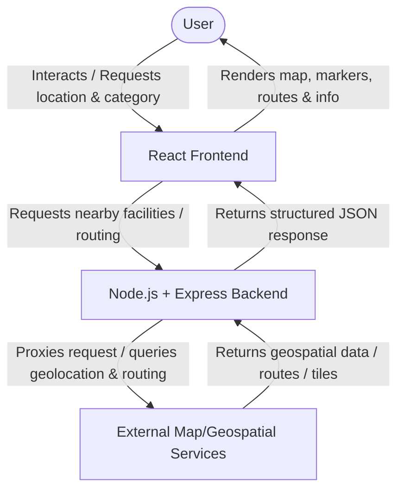

# Technical Architecture: ResQMap

This document describes the planned high-level technical architecture for ResQMap. Exact external services, specific APIs, and detailed system integration details will be finalized and documented during their respective implementation phases.

## Component Responsibilities

### 1. Frontend Responsibility
* **Technology:** React (built using Vite and styled with Tailwind CSS).
* **Role:**
  * Render the user interface, including lists, search controls, and detailed facility cards.
  * Obtain user geolocation via browser APIs.
  * Render the interactive map using Leaflet and React Leaflet.
  * Handle client-side routing, user input, and state management.

### 2. Backend Responsibility
* **Technology:** Node.js, Express.
* **Role:**
  * Act as an intermediary proxy between the React frontend and external APIs (to secure API keys, manage rate limits, and sanitize response payloads).
  * Serve static assets or host basic application configurations.
  * Formulate structured responses for the frontend.

### 3. Map / Geospatial Service Responsibility
* **Technology:** OpenStreetMap (for map tiles), Leaflet (for client-side map rendering), and future routing/discovery APIs.
* **Role:**
  * Provide map imagery tiles for the user interface.
  * Provide routing coordinates to draw paths on the map.
  * Provide geospatial query lookup for nearby facilities based on coordinates.

---

## High-Level Request/Data Flow

The primary flow of data between the user, the application components, and external services is outlined below:



Alternatively, standard tile loading occurs directly:
```
User -> React Frontend -> External Map/Geospatial Services (OSM Tile Servers) -> React Frontend -> User
```

*Note: Exact routing and geocoding services are to be decided in future implementation phases.*
