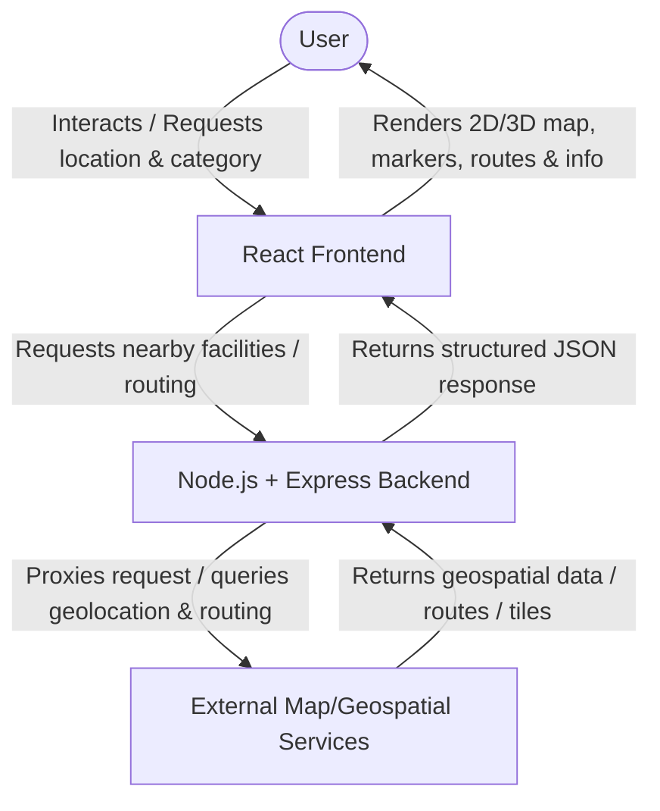

# Technical Architecture: ResQMap

This document describes the planned high-level technical architecture for ResQMap. Exact external services, specific APIs, and detailed system integration details will be finalized and documented during their respective implementation phases.

## Component Responsibilities

### 1. Frontend Responsibility
* **Technology:** React (built using Vite and styled with Tailwind CSS).
* **Role:**
  * Render the user interface, including lists, search controls, and detailed facility cards.
  * Obtain user geolocation via browser APIs.
  * Render the interactive map using MapLibre GL JS and a React-compatible MapLibre integration.
  * Handle client-side routing, user input, and state management (including shared map state between 2D and 3D modes).

### 2. Backend Responsibility
* **Technology:** Node.js, Express.
* **Role:**
  * Act as an intermediary proxy between the React frontend and external APIs (to secure API keys, manage rate limits, and sanitize response payloads).
  * Serve static assets or host basic application configurations.
  * Formulate structured responses for the frontend.

### 3. Map / Geospatial Service Responsibility
* **Technology:** OpenStreetMap-compatible vector tiles, MapLibre GL JS (for client-side rendering), and future routing/discovery APIs.
* **Role:**
  * Provide vector map tiles and style sheets for rendering.
  * Provide routing coordinates to draw paths on the map.
  * Provide geospatial query lookup for nearby facilities based on coordinates.

---

## Planned Mapping and UI Architecture

The frontend map visualization and UI hierarchy are structured conceptually as follows:

```
React (App Container)
    ↓
Application UI
    ├── Navigation/Header
    ├── Control and Results Panel
    ├── Facility Information UI
    └── Map View
            ↓
      MapLibre GL JS
            ↓
      2D or 3D/Perspective Camera
            ↓
      Map Style + Vector Tile Source
```

### Shared Map and Application State
To ensure consistency and avoid duplicate code, the application will maintain a single, shared application state. This state will conceptually track:
* **Current map mode** (2D top-down or 3D perspective)
* **Map center** (Latitude/Longitude coordinates)
* **Zoom** (Numeric scale)
* **Pitch** (Map tilt angle in degrees)
* **Bearing** (Map rotation angle in degrees)
* **User location** (when implemented)
* **Selected emergency category** (when implemented)
* **Facility data** (when implemented)
* **Selected facility** (when implemented)

*Note: This state architecture is documented for future planning. No state implementation is done during Phase 0.*

### UI Interactions and Animation Layer
Animation behavior belongs to the frontend interaction layer and should be coordinated with map state changes where necessary. Transitions (such as panel slides, staggered result listings, scale/pulse effects on selected markers, and camera transition panning) are linked directly to application state updates. No specific animation library is prescribed at this stage.

### 2D vs. 3D Rendering Modes
Both visualization modes use the exact same underlying map engine (MapLibre GL JS) and application data, but apply different camera attributes and style layers:
* **2D Mode:** Uses a top-down camera configuration (pitch = 0, bearing = 0).
* **3D Mode:** Uses pitch/tilt (camera angle greater than 0, up to 60 or 85 degrees depending on engine limits), bearing/rotation, and renders 3D building polygon extrusions where supported by the style and tile source.
* **Style and Tile Provider:** The exact style and vector tile provider are undecided until the frontend implementation phase, and will be selected based on performance, cost, licensing, and 3D feature support.

---

## High-Level Request/Data Flow

The primary flow of data between the user, the application components, and external services is outlined below:



Alternatively, vector tiles are requested directly by the map component:
```
User -> React Frontend -> Vector Tile Provider -> React Frontend (MapLibre GL JS) -> User
```

*Note: Exact routing, geocoding, and map tile services are to be decided in future implementation phases.*
